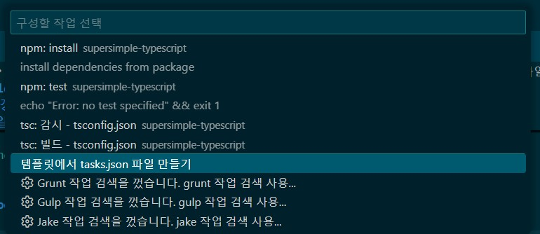
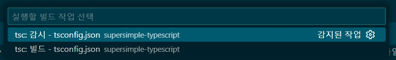
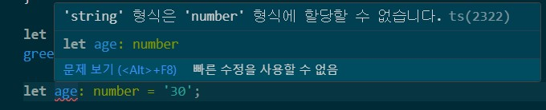

# supersimple-typescript
초간단 타입스크립트 리포지토리


## Node 환경

- Node 버전 변경과 설정

```bash
> node -v
v16.20.2
> nvm version
1.2.2

> nvm list available

|   CURRENT    |     LTS      |  OLD STABLE  | OLD UNSTABLE |
|--------------|--------------|--------------|--------------|
|    25.2.1    |   24.12.0    |   0.12.18    |   0.11.16    |
|    25.2.0    |   24.11.1    |   0.12.17    |   0.11.15    |
|    25.1.0    |   24.11.0    |   0.12.16    |   0.11.14    |
|    25.0.0    |   22.21.1    |   0.12.15    |   0.11.13    |
|   24.10.0    |   22.21.0    |   0.12.14    |   0.11.12    |
|    24.9.0    |   22.20.0    |   0.12.13    |   0.11.11    |
|    24.8.0    |   22.19.0    |   0.12.12    |   0.11.10    |
|    24.7.0    |   22.18.0    |   0.12.11    |    0.11.9    |
|    24.6.0    |   22.17.1    |   0.12.10    |    0.11.8    |
|    24.5.0    |   22.17.0    |    0.12.9    |    0.11.7    |
|    24.4.1    |   22.16.0    |    0.12.8    |    0.11.6    |
|    24.4.0    |   22.15.1    |    0.12.7    |    0.11.5    |
|    24.3.0    |   22.15.0    |    0.12.6    |    0.11.4    |
|    24.2.0    |   22.14.0    |    0.12.5    |    0.11.3    |
|    24.1.0    |   22.13.1    |    0.12.4    |    0.11.2    |
|    24.0.2    |   22.13.0    |    0.12.3    |    0.11.1    |
|    24.0.1    |   22.12.0    |    0.12.2    |    0.11.0    |
|    24.0.0    |   22.11.0    |    0.12.1    |    0.9.12    |
|   23.11.1    |   20.19.6    |    0.12.0    |    0.9.11    |
|   23.11.0    |   20.19.5    |   0.10.48    |    0.9.10    |

This is a partial list. For a complete list, visit https://nodejs.org/en/download/releases

> nvm install 24.12.0
Downloading node.js version 24.12.0 (64-bit)... 
Extracting node and npm...
Complete
Installation complete.
If you want to use this version, type:

nvm use 24.12.0

> nvm use 24.12.0
Now using node v24.12.0 (64-bit)

> node -v
> npm -v
```
- LTS 최신버전으로 설치 권장

## TypeScript 전역설치
- Visual Studio Code

```bash
> npm instlal -g typescript    // 이건 글로벌로

added 1 package in 1s
```

- Powershell 관리자 모드에서

```bash
> Set-ExecutionPolicy RemoteSigned

실행 규칙 변경
실행 정책은 신뢰하지 않는 스크립트로부터 사용자를 보호합니다. 실행 정책을 변경하면 about_Execution_Policies 도움말
항목(https://go.microsoft.com/fwlink/?LinkID=135170)에 설명된 보안 위험에 노출될 수 있습니다. 실행 정책을 변경하시겠습니까?
[Y] 예(Y)  [A] 모두 예(A)  [N] 아니요(N)  [L] 모두 아니요(L)  [S] 일시 중단(S)  [?] 도움말 (기본값은 "N"): a


```

- 터미널 재실행 후

```bash
> tsc -v
Version 5.9.3
```

## 컴파일 설정

1. TypeScript 컴파일러 설치 (완료)
2. package.json 생성
3. tsconfig.json 작성
4. VS Code에서 자동 컴파일 / 감시(watch) 설정
5. src -> dist 구조로 JS 생성

### 1. TypeScript 설치

```bash
npm install --save-dev typescript   // 이건 개발 프로젝트 별로 설치
```

### 2. package.json 생성

```bash
npm init -y
```
### 3. tsconfig.json 생성 (핵심 중의 핵심)

```bash
npx tsc --init
```

- 만들어진 tsconfig.json 내용 수정

```json
{
  "compilerOptions": {
    "target": "ES2019",
    "module": "CommonJS",
    "outDir": "./dist",
    "rootDir": "./src",
    "strict": true,
    "esModuleInterop": true,
    "sourceMap": true
  },
  "include": ["src/**/*"],
  "exclude": ["node_modules"]
}
```

- 기본 폴더구조
```text
project/
├─ src/
│  └─ index.ts
├─ dist/
│  └─ index.js   ← 자동 생성
├─ tsconfig.json
└─ package.json
```

- src/ 폴더에 .ts 작성

### 4. 컴파일 실행(수동)

```bash
npx tsc
```

- dist/ 폴더에 .js 자동생성 확인

```text
project/
├─ src/
│  └─ index.ts
├─ dist/
│  ├─ index.js
│  └─ index.js.map 
├─ tsconfig.json
└─ package.json
```

- node로 실행은

```bash
node dist/index.js
```

### 5. VS Code에서 자동 컴파일 (진짜 편한 부분)

#### Option 1

```bash
npx tsc --watch
```

- .ts 저장할 때마다
- 자동으로 .js 갱신
개발할 때 이게 제일 안정적

#### Option 2



- VS Code Task로 등록 (고급 + 깔끔)
- Ctrl + Shift + P
    - Tasks: Configure Task를 선택하고, 제공되는 템플릿
    - .vscode/tasks.json 작성

```json
{
  "version": "2.0.0",
  "tasks": [
    {
      "label": "tsc: watch",
      "type": "shell",
      "command": "npx tsc --watch",
      "problemMatcher": "$tsc",
      "isBackground": true
    }
  ]
}
```

- Ctrl + Shift + B 로 시작



## 기본 문법

### Step 01

- ts라는 확장자로 코드 작성
- tsc로 .ts를 실행하면 .js 생성됨

```bash
> cd ./step01
> /step01> tsc ./ts-0001.ts
> /step01> node ./ts-0001.js
Hello Typescript!
```

### Step 02
- https://www.typescriptlang.org/ 에서도 테스트 해  볼것
- 타입스크립트란 자바스크립트의 단점을 보완한 스크립트 언어(!)
    - 타입 정의 가능
    - 인터페이스, 클래스 문법제공
    - 세이프 코드 지원
    - 제네릭 타입 정의

- 엄격한 Null 체크 기능 명령어

```bash
tsc --strictNullChecks index.ts
```

### Step 03

```script
// 변수 선언
let ceo = 'Steve';
let ceo: string = 'Steve';

// 타입 에러
let age: number = '30';
```



```script
// 변수 범위
function calculate(isSum: boolean) {
    let first = 50;

    if (isSum) {
        let sum = first + 50;
        return sum;
    }

    return sum; // error TS2304
}

// 상수 에러
const sum: number = 100;
sum - 99;   // Compile error

// 배열
const names: string[] = [];
names.push('Eleven');
names.push(11); // ts2345 Error
```